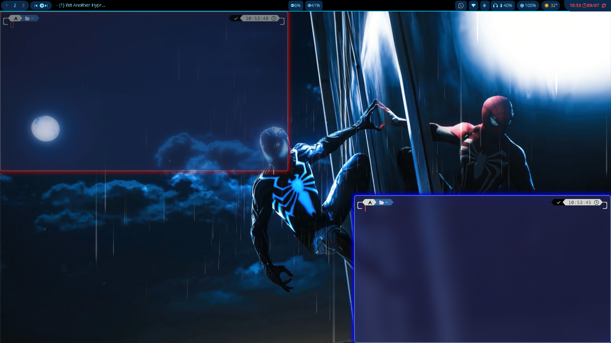
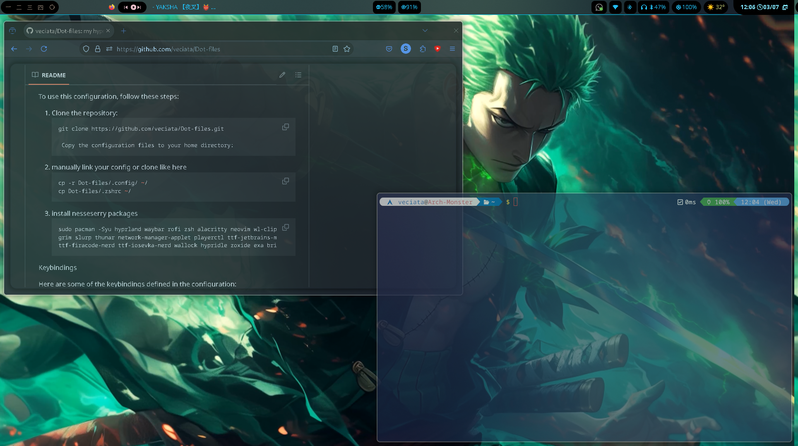
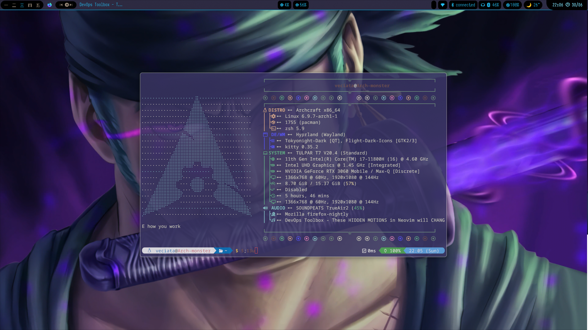
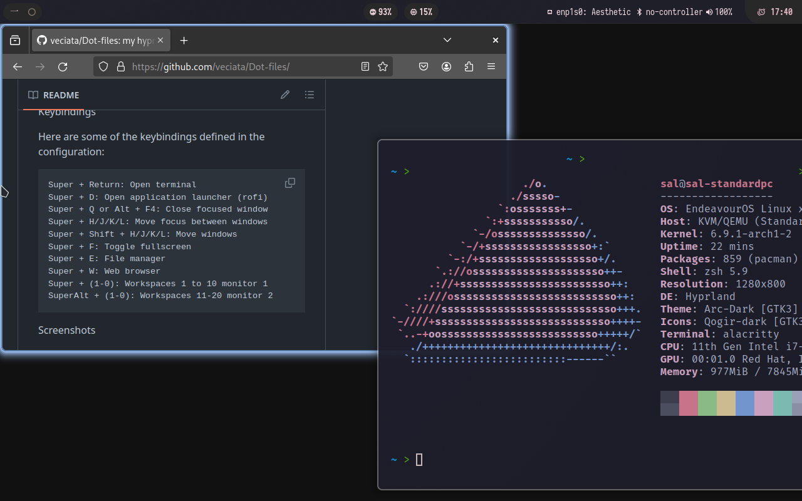

# Hyprland Configuration for my 2 Monitor Setup

Welcome to my arch based Hyprland configuration repository! This setup is optimized for a dual monitor system.

## Table of Contents

- [Screenshots](#screenshots)
- [Introduction](#introduction)
- [Installation](#installation)
- [Keybindings](#keybindings)
- [Credits](#credits)

## Screenshots











## Introduction

This repository contains my personal configuration files for [Hyprland](https://github.com/hyprwm/Hyprland), a dynamic tiling Wayland compositor. The configuration is tailored for a two-monitor setup and includes settings for various applications and utilities to enhance productivity.

## Installation

To use this configuration, follow these steps:

1. Clone the repository:

   ```sh
   git clone https://github.com/veciata/Dot-files.git

    Copy the configuration files to your home directory:

   ```

2. manually link your config or clone like here

   ```sh

   cp -r Dot-files/.config/ ~/
   cp Dot-files/.zshrc ~/
   ```

   3. install nesseserry packages

   ```sh
   sudo pacman -Syu hyprland waybar eza zsh  kitty wl-clipboard brightnessctl pavucontrol\
   grim slurp nemo network-manager-applet playerctl ttf-jetbrains-mono papirus-icon-theme\
   ttf-firacode-nerd ttf-iosevka-nerd hypridle zoxide exa gsettings-desktop-schemas polkit-gnome thefuck\
   kdeconnect ffmpeg nwg-look pulseaudio zellij pulsemixer btop partitionmanager bluez\
   font-manager ark openssh speedtest-cli\
   thunderbird yazi nm-connection-editor hostapd mpd ncmpcpp mpc qbittorrent calcurse pulsemixer

   yay -S papirus-icon-theme wallock wallock-git bibata-cursor-theme-bin nordic-theme\
   nordic-darker-theme pipewire-enable-bluez5  grimblast-git mpdevil\
   oh-my-posh brillo rofi-lbonn-wayland-git
   ```

   if you wanna change terminal you can do it on .zshrc $terminal and .config/hypr/defaultset.conf $terminal changes.

   4. install python env for weather

   ````$ sh
   python3 -m venv ~/.pyvenv &&
   source ~/.pyvenv/bin/activate &&
   cd & python -m ensurepip --upgrade &&
   pip install --upgrade pip &&
   pip install pyquery &&
   ```
   ````

## Keybindings

Here are some of the keybindings defined in the configuration:

      Super + Return: Open terminal
      Super + D: Open application launcher (rofi)
      Super + Q or Alt + F4: Close focused window
      Super + H/J/K/L: Move focus between windows
      Super + Shift + H/J/K/L: Move windows
      Super + F: Toggle fullscreen
      Super + E: File manager
      Super + W: Web browser
      Super + D11:Change wallpaper from videos use sww
      Super + (1-0): Workspaces 1 to 10 monitor 1
      SuperAlt + (1-0): Workspaces 11-20 monitor 2

## Credits

### Başlangıç olarak burdan çok fazla yararlandım global olması için ingilizce yazdım repoyu ama teşekkürümü Türkçe yapmalıyım. Dil değiştirmek istersenizde input.conf içerisinden değiştireblirsiniz

### "I have benefited a lot from here as a starting point, so I wrote the repo in English to make it more global, but I should express my gratitude in Turkish. If you want to change the language, you can do so from the input.conf file."

<https://github.com/yusufipk/hyprconf>

Hyprland
Waybar
Rofi

Feel free to customize and extend the configuration to suit your needs. If you encounter any issues or have suggestions, please open an issue on this repository.

```

```
